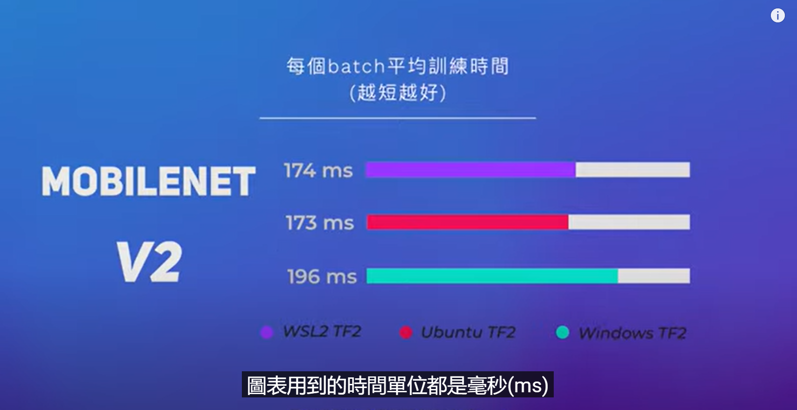
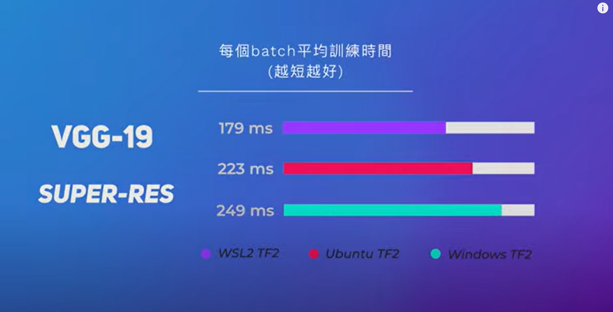

# win11在WSL2虚拟环境中使用GPU开启训练任务

## `windows11`更新
* 点击`设置`->`Windows更新`->`检查更新`，先把系统更新到最新状态。

## `wsl`指令知识总结
```shell
#关闭系统：
wsl --shutdown
#取消注册或者卸载系统：
wsl --unregister Ubuntu-20.04
#重装：
wsl --install --distribution Ubuntu-20.04
#或者点击：开始->ubuntu图标
#查看linux内核版本：
wsl cat /proc/version
#Linux version 5.10.102.1-microsoft-standard-WSL2

# 将分发系统导出后缀名为`TAR`的文件
wsl --export <Distribution Name> <FileName>
# wsl --export Ubuntu-20.04 Ubuntu-20.04.tar

# 将指定的tar包文件作为新发行版导入
wsl --import <Distribution Name> <InstallLocation FileName>
#wsl --import Ubuntu-20.04 Ubuntu-20.04.tar
```


* `wsl2`安装过程中可能出现的问题以及解决方案
```text
如果出现WslRegisterDistribution failed with error: 0x800701bc Error: 0x800701bc WSL 2 ?????????????????? https://aka.ms/wsl2kernel问题，
参考如下链接https://blog.csdn.net/qq_18625805/article/details/109732122
下载链接：https://wslstorestorage.blob.core.windows.net/wslblob/wsl_update_x64.msi，更新WSL2 Linux 内核
```


## `Ubuntu20.04`软件更新步骤
* 修改镜像源
```shell
#第一步：备份源文件：
sudo cp /etc/apt/sources.list /etc/apt/sources.list.backup

#第二步：编辑/etc/apt/sources.list文件
sudo vim /etc/apt/sources.list
```
* 拷贝粘贴如下的国内镜像源
```text
deb https://mirrors.ustc.edu.cn/ubuntu/ focal main restricted universe multiverse
deb-src https://mirrors.ustc.edu.cn/ubuntu/ focal main restricted universe multiverse
deb https://mirrors.ustc.edu.cn/ubuntu/ focal-updates main restricted universe multiverse
deb-src https://mirrors.ustc.edu.cn/ubuntu/ focal-updates main restricted universe multiverse
deb https://mirrors.ustc.edu.cn/ubuntu/ focal-backports main restricted universe multiverse
deb-src https://mirrors.ustc.edu.cn/ubuntu/ focal-backports main restricted universe multiverse
deb https://mirrors.ustc.edu.cn/ubuntu/ focal-security main restricted universe multiverse
deb-src https://mirrors.ustc.edu.cn/ubuntu/ focal-security main restricted universe multiverse
deb https://mirrors.ustc.edu.cn/ubuntu/ focal-proposed main restricted universe multiverse
deb-src https://mirrors.ustc.edu.cn/ubuntu/ focal-proposed main restricted universe multiverse
```
* 软件更新升级
```shell
sudo apt update && sudo apt upgrade -y && sudo apt autoremove -y
```

## `wsl2`虚拟机的`Ubuntu20.04`系统安装可视化的应用程序
* [参考](https://docs.microsoft.com/en-us/windows/wsl/tutorials/gui-apps)安装教程进行操作


## `vscode`安装路径
```text
C:\Users\zhuji\AppData\Local\Programs\Microsoft VS Code
#彻底卸载vscode方法：https://bbs.huaweicloud.com/blogs/254150
```

## 安装`google chrome`浏览器
```shell
sudo wget https://dl.google.com/linux/direct/google-chrome-stable_current_amd64.deb
sudo apt --fix-broken  -y install ./google-chrome-stable_current_amd64.deb
```


## `win11`安装最新的`nvidia`驱动软件
```text
参考https://www.nvidia.com/download/index.aspx选取516.59-notebook-win10-win11-64bit-international-dch-whql.exe软件进行安装升级。
```

## 在`wsl2`虚拟环境系统中安装不带显卡驱动的`cuda`软件包
* [参考](https://docs.nvidia.com/cuda/wsl-user-guide/index.html)安装`nvidia cuda`
* 其他`cuda`版本不带显卡的软件包安装教程[参考](https://developer.nvidia.com/cuda-toolkit-archive)
* 以`cuda11.7`举例在`wsl2`环境中安装`cuda`软件包
```shell
sudo apt-key del 7fa2af80
wget https://developer.download.nvidia.com/compute/cuda/repos/wsl-ubuntu/x86_64/cuda-wsl-ubuntu.pin
sudo mv cuda-wsl-ubuntu.pin /etc/apt/preferences.d/cuda-repository-pin-600
wget https://developer.download.nvidia.com/compute/cuda/11.7.0/local_installers/cuda-repo-wsl-ubuntu-11-7-local_11.7.0-1_amd64.deb
sudo dpkg -i cuda-repo-wsl-ubuntu-11-7-local_11.7.0-1_amd64.deb
sudo apt-get update
sudo apt-get -y install cuda
```
* [参考](https://docs.nvidia.com/cuda/wsl-user-guide/index.html)安装带`nvidia-docker`功能的`docker`软件

* 赋予`docker`管理员权限
```shell
sudo usermod -aG docker ${USER}
# 该命令需要重启系统后才能生效
```

## 深度学习训练任务在不同环境下的训练速度对比
* `wsl2`虚拟机vs`linux`vs`本地win11`

* `mobilenet v2`


* `vgg-19`




## `wsl2`虚拟机本地`gpu`显卡性能`benchmark`测试
```shell
sudo docker run --rm -it --gpus=all nvcr.io/nvidia/k8s/cuda-sample:nbody nbody -gpu -benchmark
```
* 输出结果
```text
Unable to find image 'nvcr.io/nvidia/k8s/cuda-sample:nbody' locally
nbody: Pulling from nvidia/k8s/cuda-sample
11323ed2c653: Pull complete 
b6166589502e: Pull complete 
df6d4a51da82: Pull complete 
a65da20ce53d: Pull complete 
f02d6169d353: Pull complete 
56e9fab00773: Pull complete 
af3342639518: Pull complete 
95e5f8cb48e9: Pull complete 
ba0cb6713727: Pull complete 
Digest: sha256:fa0c8b471d223df44b82795dee54a7bc36d372fc5a2c7197f8df89e30f2abf48
Status: Downloaded newer image for nvcr.io/nvidia/k8s/cuda-sample:nbody
Run "nbody -benchmark [-numbodies=<numBodies>]" to measure performance.
        -fullscreen       (run n-body simulation in fullscreen mode)
        -fp64             (use double precision floating point values for simulation)
        -hostmem          (stores simulation data in host memory)
        -benchmark        (run benchmark to measure performance) 
        -numbodies=<N>    (number of bodies (>= 1) to run in simulation) 
        -device=<d>       (where d=0,1,2.... for the CUDA device to use)
        -numdevices=<i>   (where i=(number of CUDA devices > 0) to use for simulation)
        -compare          (compares simulation results running once on the default GPU and once on the CPU)
        -cpu              (run n-body simulation on the CPU)
        -tipsy=<file.bin> (load a tipsy model file for simulation)

NOTE: The CUDA Samples are not meant for performance measurements. Results may vary when GPU Boost is enabled.

> Windowed mode
> Simulation data stored in video memory
> Single precision floating point simulation
> 1 Devices used for simulation
GPU Device 0: "Ampere" with compute capability 8.6

> Compute 8.6 CUDA device: [NVIDIA GeForce RTX 3080 Laptop GPU]
49152 bodies, total time for 10 iterations: 46.505 ms
= 519.497 billion interactions per second
= 10389.942 single-precision GFLOP/s at 20 flops per interaction
```


## 训练`yolov5`
```shell
git clone 
sudo apt install python3.8-venv
python3 -m venv ./venv_yolov5
source venv_yolov5/bin/activate #进入虚拟环境
deactivate #退出虚拟环境
```

## [wsl2高级选项配置](https://docs.microsoft.com/en-us/windows/wsl/wsl-config)
* 编辑`C:\Users\zhuji\.wslconfig`配置文件
```text
# Settings apply across all Linux distros running on WSL 2
[wsl2]
guiapplications=false
# Limits VM memory to use no more than 4 GB, this can be set as whole numbers using GB or MB
memory=16GB 

# Sets the VM to use two virtual processors
processors=4

# Specify a custom Linux kernel to use with your installed distros. The default kernel used can be found at https://github.com/microsoft/WSL2-Linux-Kernel
# kernel=C:\\temp\\myCustomKernel

# Sets additional kernel parameters, in this case enabling older Linux base images such as Centos 6
kernelCommandLine = vsyscall=emulate

# Sets amount of swap storage space to 8GB, default is 25% of available RAM
swap=16GB

# Sets swapfile path location, default is %USERPROFILE%\AppData\Local\Temp\swap.vhdx
# swapfile=C:\\temp\\wsl-swap.vhdx

# Disable page reporting so WSL retains all allocated memory claimed from Windows and releases none back when free
pageReporting=false

# Turn off default connection to bind WSL 2 localhost to Windows localhost
localhostforwarding=true

# Disables nested virtualization
nestedVirtualization=false

# Turns on output console showing contents of dmesg when opening a WSL 2 distro for debugging
debugConsole=true

```
* 关闭所有`wsl2`开启的虚拟机系统，打开`powershell`终端，
```shell
# 查看目前正在运行的虚拟机系统
wsl -l --running
# 关闭所有的虚拟机系统
wsl --shutdow
# 再输入wsl -l --running查看是否还有虚拟机系统在运行，如果没有再启动虚拟机系统，则配置文件生效。
```